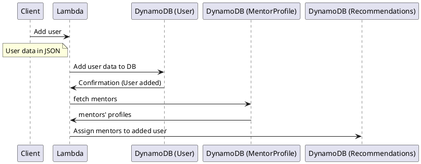
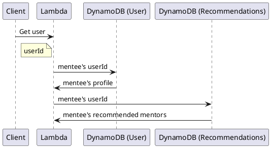
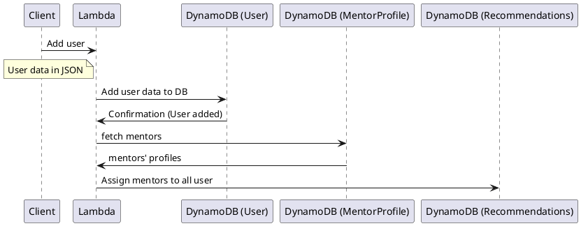
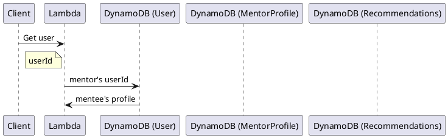
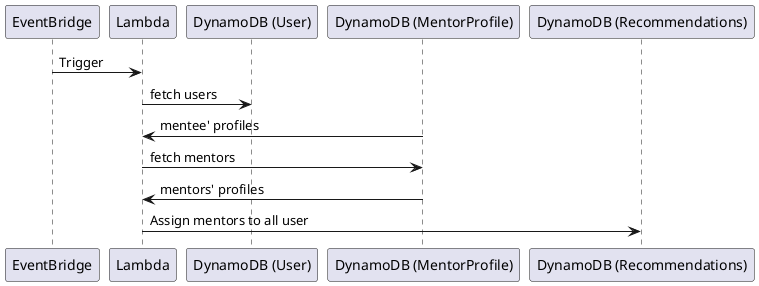

## uml: sequence diagram

### Add User (Mentee)




### Get User (Mentee)




### Add User (Mentor)




### Get User (Mentor)





### Weekly Trigger





<!-- ```
' Participant OpenAI
' Participant Secrets
' Participant Pinecone
' Participant EventBridge
' Lambda -> OpenAI: Send text for embedding
' OpenAI -> Lambda: Return embeddings
' Lambda -> Secrets: Retrieve API keys or credentials
' Secrets -> Lambda: Provide API keys or credentials
' Lambda -> Pinecone: Store/retrieve embeddings
' Pinecone -> Lambda: Return embeddings based on userid
' Lambda -> EventBridge: Trigger events
```
  


```plantuml
@startuml
Participant Client
Participant Lambda
Participant DynamoDB
' Participant OpenAI
' Participant Secrets
' Participant Pinecone
' Participant EventBridge

Client -> Lambda: Add user
Lambda -> DynamoDB: Add user data to DB
' Lambda -> OpenAI: Send text for embedding
' OpenAI -> Lambda: Return embeddings
' Lambda -> Secrets: Retrieve API keys or credentials
' Secrets -> Lambda: Provide API keys or credentials
' Lambda -> Pinecone: Store/retrieve embeddings
' Pinecone -> Lambda: Return embeddings based on userid
' Lambda -> EventBridge: Trigger events
@enduml
``` -->


