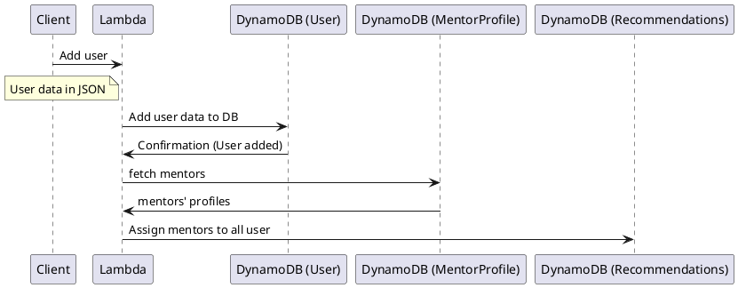

```plantuml
@startuml
Participant Client
Participant Lambda
Participant "DynamoDB (User)"
Participant "DynamoDB (MentorProfile)"
Participant "DynamoDB (Recommendations)"


Client -> Lambda: Add user
Note left of Lambda: User data in JSON
Lambda -> "DynamoDB (User)": Add user data to DB

"DynamoDB (User)" -> Lambda: Confirmation (User added)

Lambda -> "DynamoDB (MentorProfile)": fetch mentors
"DynamoDB (MentorProfile)" -> Lambda : mentors' profiles

Lambda -> "DynamoDB (Recommendations)": Assign mentors to all user
@enduml
```