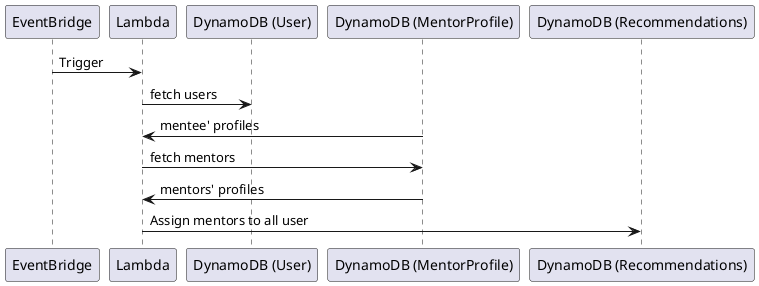

```plantuml
@startuml
Participant EventBridge
Participant Lambda
Participant "DynamoDB (User)"
Participant "DynamoDB (MentorProfile)"
Participant "DynamoDB (Recommendations)"


EventBridge -> Lambda: Trigger
' Lambda -> "DynamoDB (User)": Add user data to DB

' "DynamoDB (User)" -> Lambda: Confirmation (User added)

Lambda -> "DynamoDB (User)": fetch users
"DynamoDB (MentorProfile)" -> Lambda : mentee' profiles

Lambda -> "DynamoDB (MentorProfile)": fetch mentors
"DynamoDB (MentorProfile)" -> Lambda : mentors' profiles

Lambda -> "DynamoDB (Recommendations)": Assign mentors to all user
@enduml
```