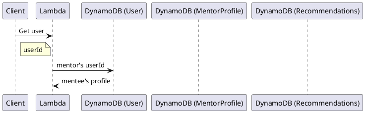

```plantuml
@startuml
Participant Client
Participant Lambda
Participant "DynamoDB (User)"
Participant "DynamoDB (MentorProfile)"
Participant "DynamoDB (Recommendations)"


Client -> Lambda: Get user
Note left of Lambda: userId
Lambda -> "DynamoDB (User)": mentor's userId

"DynamoDB (User)" -> Lambda: mentee's profile
@enduml
```